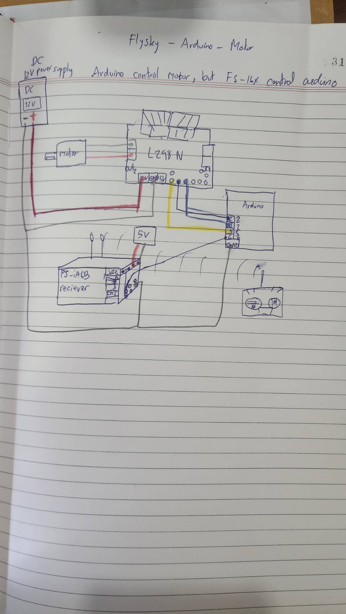

# ros2_control_demo_example_10_myhardware

   *RRBot* - or ''Revolute-Revolute Manipulator Robot'' - with GPIO interfaces, using arduino to move motor with ros2_control demo example 10
   
 Using Flysky receiver as an input GPIO, and using ros2 pub to move motor as output GPIO.
 
 Note. This project still is not very good. because I found blocking operation created by arduino_.read().
   
Terminal 1

```
cd ~/ros2_ws
source install/setup.bash
colcon build --packages-select ros2_control_demo_example_10_myhardware
source install/setup.bash; ros2 launch ros2_control_demo_example_10_myhardware rrbot.launch.py
```

Terminal 2

```
ros2 topic pub /gpio_controller/commands control_msgs/msg/DynamicInterfaceGroupValues "{interface_groups: [flange_vacuum, flange_analog_IOs], interface_values: [{interface_names: [vacuum], values: [0.27]}, {interface_names: [analog_output1], values: [0.5]} ]}"
```

Electronic circuits


